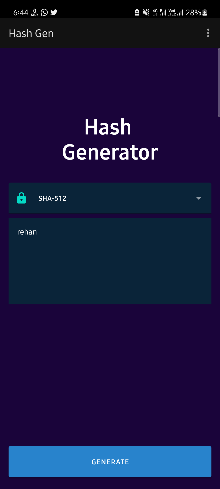
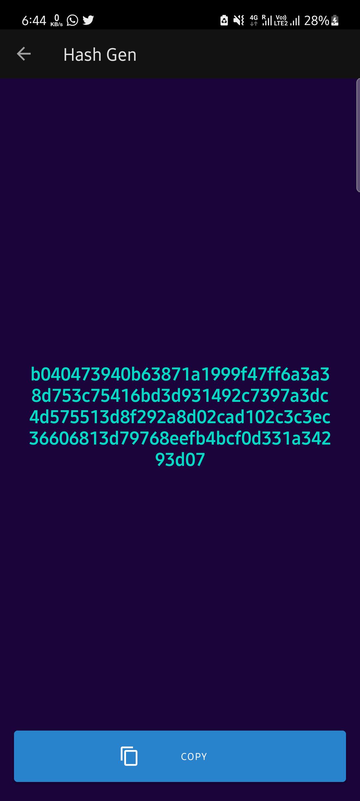

# HashGenerator
It is a encryption key generator app using kotlin.  
It is a dummy project especially made for the learning purpose.  
 
 
 
 
## Screenshots

[<video width="320" height="240" autoplay>
  <source src="hashgenvideo.mp4" type="video/mp4">
</video>]
